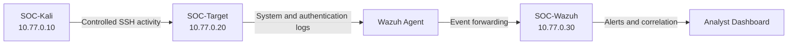

# SOC Incident Response Lab

A practical Security Operations Center lab built in VirtualBox to develop
hands-on experience with endpoint monitoring, alert triage, log correlation,
incident investigation, and security hardening.

The environment contains an event-generation system, a monitored Linux server,
and a Wazuh SIEM platform. It is intentionally isolated from the home network
and the Internet, making each exercise controlled and repeatable.

## Project Objectives

- Build a small but functional SOC monitoring environment.
- Understand how endpoint activity becomes a SIEM alert.
- Practice investigating authentication-related security events.
- Map observed activity to the MITRE ATT&CK framework.
- Document evidence, findings, and recommended remediation.
- Maintain a safe environment for repeatable attack-and-defense exercises.

## Lab Architecture

| Virtual machine | Role | IP address |
| --- | --- | --- |
| `SOC-Kali` | Controlled security testing and event generation | `10.77.0.10` |
| `SOC-Target` | Monitored Ubuntu Server and SSH service | `10.77.0.20` |
| `SOC-Wazuh` | SIEM manager, indexer, dashboard, and log analysis | `10.77.0.30` |



All three virtual machines use the VirtualBox Internal Network `soc-lab`.
There is no NAT adapter, bridged adapter, default gateway, or direct Internet
access inside the lab.

## Security Controls

The environment was configured with the following controls:

- Static IP addressing on the dedicated `10.77.0.0/24` lab subnet.
- VirtualBox adapters restricted to the internal network `soc-lab`.
- UFW permits SSH access only from the internal lab subnet.
- Direct SSH root login is disabled on the Ubuntu target.
- The Wazuh agent monitors the target and forwards endpoint telemetry.
- Baseline snapshots allow the environment to be restored after testing.
- VM startup is controlled to account for the host's 16 GB RAM limit.

## Attack Vectors and Detection Coverage

The table separates completed work from future scenarios. Only the SSH
password-guessing scenario has been executed and documented in this version.

| Attack vector or use case | Security risk | Detection source | MITRE ATT&CK | Status |
| --- | --- | --- | --- | --- |
| Repeated SSH password attempts | Credential guessing against a remote service | `sshd`, PAM, Wazuh correlation | `T1110 — Brute Force` | Completed |
| Access with valid SSH credentials | Unauthorized remote access using a compromised account | `sshd`, authentication logs | `T1078 — Valid Accounts`, `T1021.004 — SSH` | Planned |
| Unauthorized system file changes | Persistence or configuration tampering | Wazuh File Integrity Monitoring | Mapping will be validated during the exercise | Planned |
| Suspicious shell activity | Post-authentication command execution | Linux audit and endpoint logs | Mapping will be validated during the exercise | Planned |

## Completed Scenario: SSH Authentication Failures

The first scenario generated exactly 12 failed SSH login attempts from
`SOC-Kali` against the `soc-test` account on `SOC-Target`.

### Event Flow

1. Kali initiated controlled SSH authentication attempts.
2. The Ubuntu target recorded the failures through `sshd` and PAM.
3. The Wazuh agent forwarded the endpoint events to the manager.
4. Wazuh created individual authentication alerts and a correlated
   brute-force alert.
5. The events were filtered and reviewed in the Wazuh dashboard.
6. The investigation confirmed that no login attempt was successful.

### Detection Results

| Rule | Level | Detection |
| --- | ---: | --- |
| `5760` | 5 | SSH authentication failed |
| `5551` | 10 | Multiple PAM authentication failures in a short period |
| `5763` | 10 | SSH brute-force activity detected |

The 12 attempts appeared as 11 events under rule `5760` and one correlated
event under rule `5763`.

```text
11 × rule 5760 + 1 × rule 5763 = 12 authentication attempts
```

### Investigation Findings

| Field | Observed value |
| --- | --- |
| Source | `SOC-Kali`, `10.77.0.10` |
| Destination | `SOC-Target`, `10.77.0.20` |
| Target account | `soc-test` |
| Service | SSH |
| Authentication attempts | 12 |
| Successful authentication | No |
| Assessment | True positive generated by an authorized simulation |


The detailed analysis and supporting screenshots are available in the
[incident report](docs/incident-report.md).

## Skills Demonstrated

- VirtualBox network segmentation and virtual machine configuration.
- Linux static network configuration and basic SSH hardening.
- Host firewall configuration with UFW.
- Wazuh agent enrollment and endpoint monitoring.
- SIEM filtering, alert triage, and event correlation.
- Interpretation of SSH and PAM authentication telemetry.
- MITRE ATT&CK mapping and incident documentation.
- Evidence collection and validation of investigation findings.

## Repository Structure

```text
README.md                      Project overview and results
docs/setup.md                  Lab configuration overview
docs/incident-report.md        Analysis of the first detection scenario
docs/images/                   Selected Wazuh evidence
guest-config/                  Network configuration used inside the VMs
scenarios/                     Controlled test procedures
scripts/                       Host-side helper scripts and usage notes
```

## Reproducing the Lab

1. Review the [setup documentation](docs/setup.md).
2. Create the three VMs and connect only their internal network adapters.
3. Apply the guest network configurations from `guest-config/`.
4. Confirm that no VM has a default route or external network adapter.
5. Verify that the `soc-target` Wazuh agent is active.
6. Take baseline snapshots before generating test activity.
7. Follow the
   [SSH authentication failure scenario](scenarios/01-ssh-auth-failures/README.md).

The scripts in `scripts/` are documented helper tools. They do not replace the
manual setup and verification steps.

## Safety and Authorization

The event-generation script is intentionally restricted to source
`10.77.0.10` and destination `10.77.0.20`. It stops when a default route is
detected and performs exactly 12 attempts. These safeguards should not be
removed.

All activity documented in this repository was performed against systems owned
and controlled by the lab operator. The scripts and scenarios must not be used
against external or unauthorized systems.

## Planned Improvements

- Replace any remaining default credentials with unique passwords.
- Configure SSH key-based authentication.
- Disable SSH password authentication.
- Repeat the authentication scenario after hardening and compare the alerts.
- Add a Wazuh File Integrity Monitoring scenario.
- Add a controlled valid-account detection scenario.
- Create a concise incident-response checklist for future investigations.
