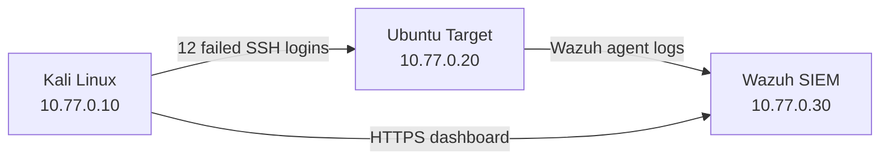

# SOC Incident Response Lab

A practical, isolated security operations lab built with VirtualBox. The project
was created to develop foundational skills in log analysis, alert investigation,
incident documentation, and basic infrastructure hardening.

## Lab Architecture

| Virtual machine | Role | IP address |
| --- | --- | --- |
| `SOC-Kali` | Controlled event generation | `10.77.0.10` |
| `SOC-Target` | Monitored Ubuntu Server | `10.77.0.20` |
| `SOC-Wazuh` | SIEM, log analysis, and dashboard | `10.77.0.30` |

All virtual machines use the VirtualBox Internal Network `soc-lab`. The lab has
no NAT adapter, bridged adapter, default gateway, or direct Internet access.



## Project Outcomes

- Deployed and configured three virtual machines.
- Assigned static IP addresses inside an isolated network.
- Restricted SSH access to the `10.77.0.0/24` lab subnet with UFW.
- Connected the Ubuntu endpoint to the Wazuh manager.
- Generated a controlled sequence of 12 failed SSH authentication attempts.
- Identified and reviewed the resulting Wazuh alerts.
- Created baseline snapshots for recovery and repeatable testing.

## Detection Scenario

Kali generated 12 unsuccessful SSH login attempts against the `soc-test`
account on the Ubuntu target. Wazuh detected both individual authentication
failures and correlated brute-force activity.

| Rule | Level | Detection |
| --- | ---: | --- |
| `5760` | 5 | SSH authentication failed |
| `5551` | 10 | Multiple PAM authentication failures |
| `5763` | 10 | SSH brute-force activity detected |

The activity was mapped to MITRE ATT&CK technique `T1110 — Brute Force`.


The complete analysis is available in the
[incident report](docs/incident-report.md).

## Repository Structure

```text
docs/setup.md                  Lab configuration overview
docs/incident-report.md        Analysis of the first detection scenario
guest-config/                  Network configuration used inside the VMs
scenarios/                     Controlled test procedure
scripts/                       Host-side helper scripts and usage notes
```

## Safety Scope

The event-generation script is intentionally restricted to source
`10.77.0.10` and destination `10.77.0.20`. It stops if a default route is
detected and performs exactly 12 attempts. These safeguards should not be
removed, and the script should only be used inside an authorized lab.

## Planned Improvements

- Replace default credentials with unique passwords.
- Configure SSH key-based authentication.
- Disable SSH password authentication.
- Repeat the scenario after hardening and compare the resulting alerts.
