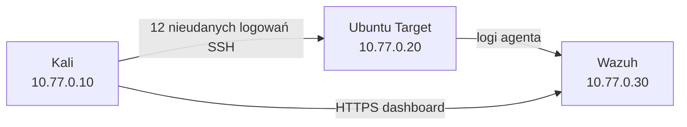

# SOC Incident Response Lab

Mój domowy lab do nauki podstaw pracy analityka SOC. Środowisko działa w
VirtualBoxie i jest odizolowane od sieci domowej oraz Internetu.

## Maszyny

| Maszyna | Rola | Adres |
| --- | --- | --- |
| `SOC-Kali` | generowanie zdarzeń | `10.77.0.10` |
| `SOC-Target` | monitorowany Ubuntu Server | `10.77.0.20` |
| `SOC-Wazuh` | SIEM i dashboard | `10.77.0.30` |

Wszystkie VM korzystają tylko z VirtualBox Internal Network `soc-lab`. Nie mają
NAT, Bridged Adapter ani bramy domyślnej.



## Co udało się zrobić

- zainstalować i skonfigurować trzy VM;
- ustawić statyczne adresy w izolowanej sieci;
- ograniczyć SSH firewallem do `10.77.0.0/24`;
- podłączyć agenta Ubuntu do Wazuh;
- wygenerować 12 kontrolowanych nieudanych logowań;
- odnaleźć i przeanalizować alerty Wazuh;
- wykonać snapshoty bazowe.

## Wykryty scenariusz

Kali wykonało 12 nieudanych prób logowania SSH na konto `soc-test`. Wazuh
wykrył pojedyncze błędy oraz brute force:

| Reguła | Poziom | Opis |
| --- | ---: | --- |
| `5760` | 5 | nieudane logowanie SSH |
| `5551` | 10 | wiele błędów PAM w krótkim czasie |
| `5763` | 10 | wykryty SSH brute force |

MITRE ATT&CK: `T1110 — Brute Force`.


Dokładniejszy opis znajduje się w
[raporcie incydentu](docs/incident-report.md).

## Pliki

```text
docs/setup.md                  skrócony opis konfiguracji
docs/incident-report.md        analiza pierwszego incydentu
guest-config/                  użyte konfiguracje gości
scenarios/                     opis scenariusza
scripts/                       pomocnicze skrypty Windows
```

## Bezpieczeństwo

Skrypt scenariusza działa tylko z Kali `10.77.0.10`, tylko przeciwko
`10.77.0.20` i zatrzymuje się, jeżeli wykryje trasę domyślną. Nie należy
zmieniać tych zabezpieczeń ani używać skryptu poza własnym labem.

## Następne kroki

- zmienić wszystkie hasła domyślne;
- skonfigurować logowanie SSH kluczem;
- wyłączyć `PasswordAuthentication`;
- powtórzyć test i porównać alerty po hardeningu.
