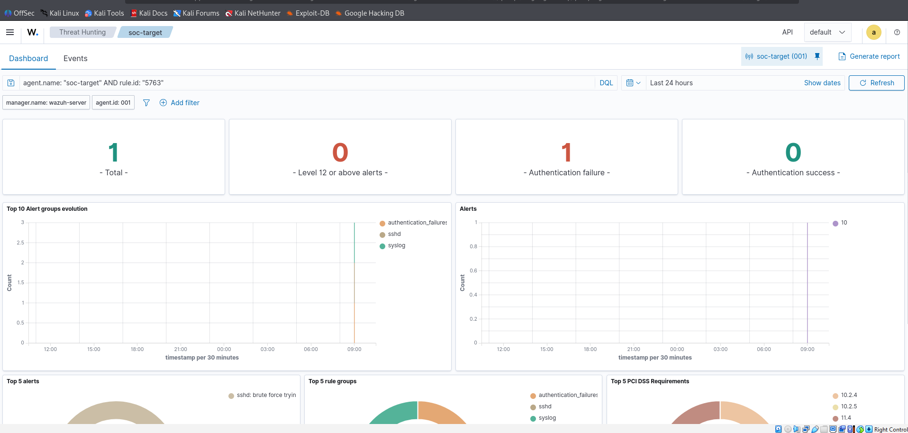
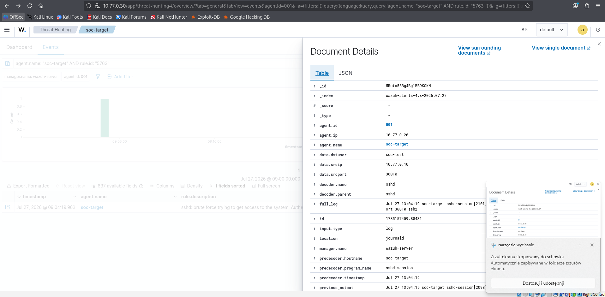
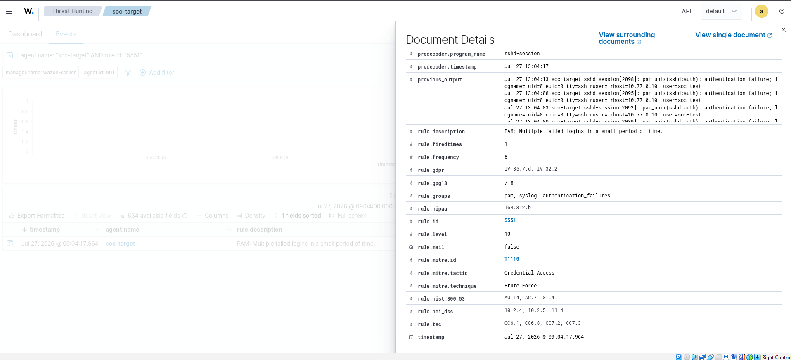

# Incident 01 — SSH brute force

## Podsumowanie

27 lipca 2026 r. host `10.77.0.10` wykonał 12 nieudanych prób logowania SSH
na konto `soc-test` na serwerze `10.77.0.20`. Wazuh oznaczył zdarzenie jako
brute force. Logowanie nie powiodło się.

Była to zaplanowana symulacja we własnym, izolowanym labie.

## Najważniejsze dane

| Pole | Wartość |
| --- | --- |
| źródło | `SOC-Kali`, `10.77.0.10` |
| cel | `SOC-Target`, `10.77.0.20` |
| konto | `soc-test` |
| usługa | SSH |
| liczba prób | 12 |
| udane logowanie | nie |

## Timeline UTC

| Czas | Zdarzenie |
| --- | --- |
| `13:03:51` | pierwsze `Failed password` |
| `13:04:17.964` | reguła `5551` — wiele błędów PAM |
| `13:04:19.963` | reguła `5763` — SSH brute force |
| `13:04:34` | ostatnie `Failed password` |

## Dowody

Reguła `5763` osiągnęła poziom 10:



Szczegóły alertu pokazują:

- `agent.ip: 10.77.0.20`;
- `data.srcip: 10.77.0.10`;
- `data.dstuser: soc-test`;
- dekoder `sshd`.



Reguła `5551` została przypisana do MITRE `T1110 — Brute Force`:



## Dlaczego w filtrze 5760 było 11 wyników?

Target zapisał 12 wpisów `Failed password`. W Wazuh jedenaście pozostało pod
regułą `5760`, a jedna próba została podniesiona do reguły korelacyjnej `5763`.

```text
11 × 5760 + 1 × 5763 = 12 prób
```

## Wniosek

Alert jest true positive, ale był autoryzowaną symulacją. Nie znaleziono udanego
logowania. Agent, dekodery SSH/PAM oraz korelacja Wazuh zadziałały poprawnie.

Kolejnym krokiem będzie logowanie kluczem SSH, wyłączenie uwierzytelniania
hasłem i ponowne wykonanie kontrolowanego testu.
