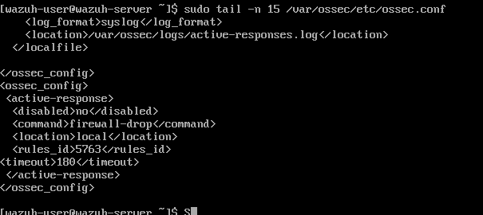
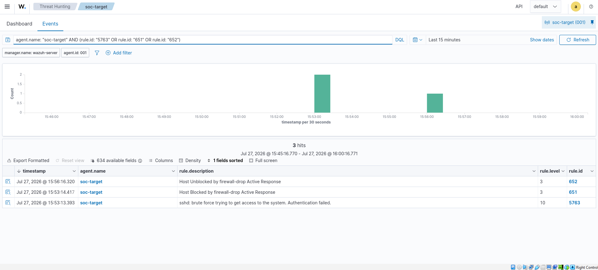
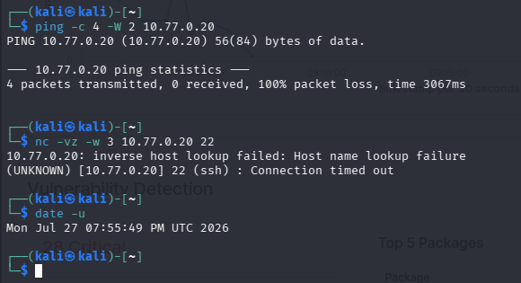
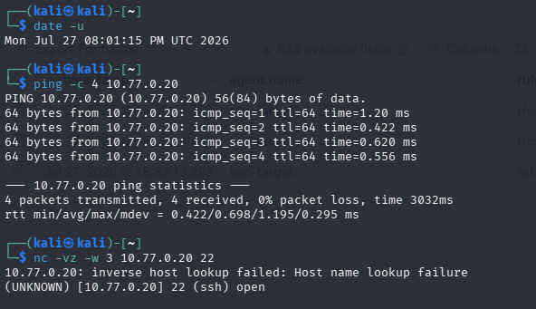

# Incident Response 02 - Automated SSH Containment

## Executive Summary

On July 27, 2026, the isolated source host `10.77.0.10` generated a bounded
sequence of failed SSH authentication attempts against `10.77.0.20`. Wazuh
detected the activity as SSH brute force and automatically executed the
`firewall-drop` response on the monitored endpoint.

The source was blocked for approximately 180 seconds. During containment,
ICMP traffic was dropped and SSH connections timed out. Wazuh then removed the
block automatically, and both ICMP and SSH connectivity returned.

This was an authorized validation performed entirely within the VirtualBox
Internal Network `soc-lab`.

## Response Configuration

| Field | Value |
| --- | --- |
| Trigger rule | `5763` |
| Response command | `firewall-drop` |
| Execution location | Local monitored endpoint |
| Blocked source | `10.77.0.10` |
| Protected endpoint | `10.77.0.20` |
| Configured timeout | 180 seconds |

## Timeline

Times below are displayed by the Wazuh dashboard:

| Time | Rule | Event |
| --- | ---: | --- |
| `15:53:13.393` | `5763` | SSH brute-force activity detected |
| `15:53:14.417` | `651` | Source host blocked |
| `15:56:16.320` | `652` | Source host automatically unblocked |

The measured interval between the block and unblock alerts was approximately
182 seconds, consistent with the configured 180-second timeout plus event
processing time.

## Control Validation

### Containment

While the response was active:

- Four ICMP packets were transmitted and none were received.
- Packet loss was 100%.
- TCP/22 returned a connection timeout.

### Recovery

After Wazuh removed the temporary firewall rule:

- Four ICMP packets were transmitted and received.
- Packet loss returned to 0%.
- TCP/22 was reachable again.

## Assessment

The scenario was a true positive generated by an authorized test. Wazuh
completed the full response lifecycle:

1. Detected correlated SSH authentication failures.
2. Contained the source automatically.
3. Logged the containment action.
4. Reverted the firewall block after the configured timeout.
5. Logged the recovery action.

No successful authentication was observed. The result demonstrates that the
SIEM can move beyond alert generation and perform a controlled endpoint
response.

## Operational Considerations

Automated blocking can also affect legitimate administrators if detection
rules are too broad. Production use would require tested allowlists, response
ownership, false-positive monitoring, and an out-of-band recovery method.
Time-limited blocking was used in this lab to reduce lockout risk.
